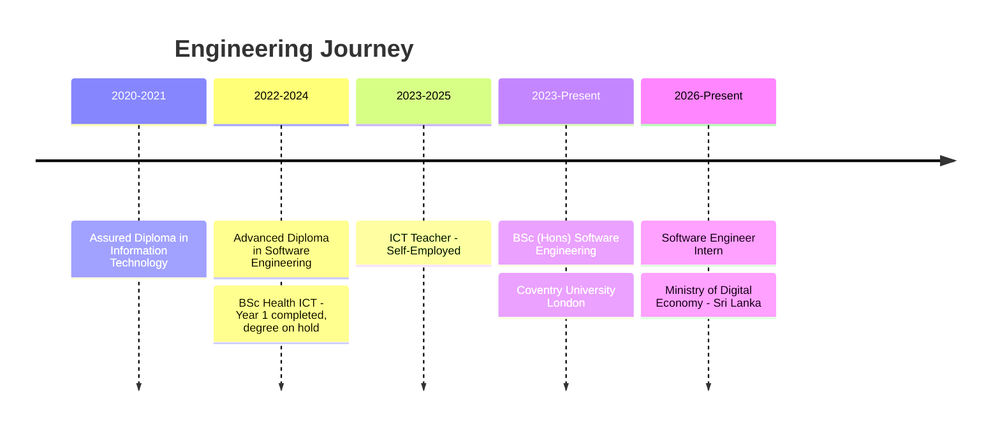

<div align="center">



<a href="https://git.io/typing-svg">
  
</a>

[](https://www.kisanduwethmal.me/)
[](https://www.linkedin.com/in/kisandu-wethmal-9ba67633b/)
[](mailto:kisanduofficially@gmail.com)
[](https://github.com/Wethmal)

</div>

---

## `> whoami`

<table>
<tr>
<td width="64%" valign="top">

### 🧬 Digital Identity

I am **Kisandu Wethmal**, a **Software Engineering (Applied AI) undergraduate** from Sri Lanka, focused on transforming ambitious ideas into secure, scalable and intelligent software.

My work combines **full-stack engineering**, **machine learning**, **computer vision**, **predictive analytics** and **automation**. I am currently contributing to Sri Lanka's digital transformation ecosystem through software engineering work connected with the **Ministry of Digital Economy**.

```yaml
identity:
  role: Software Engineer Intern
  focus: [Applied AI, Full-Stack, GovTech, SaaS]
  location: Kandana, Sri Lanka
  mission: Build intelligent systems with measurable public impact
  principles: [Clean Architecture, Security, Scalability, Continuous Learning]
```

</td>
<td width="36%" valign="top">

### ⚡ Current Signal

- 🏛️ Building digital government solutions
- 🧠 Exploring applied AI transformation
- 🛡️ Designing secure REST APIs and workflows
- ☁️ Working with cloud-ready enterprise systems
- 🚀 Creating scalable SaaS product concepts
- 📚 Maintaining a **3.82 / 4.00 GPA**

</td>
</tr>
</table>

---

## `> technology_matrix`

<div align="center">

### Core Languages


### Web, Mobile & Frameworks


### Data, Cloud & Design


### Engineering Toolkit


</div>

<details>
<summary><b>🛰️ Expand full capability map</b></summary>
<br/>

| Domain | Technologies |
|---|---|
| **Programming** | Python, Java, C#, JavaScript, HTML, SQL, PHP |
| **Web Engineering** | React.js, Vite, Node.js, Express.js, Spring Boot, ASP.NET |
| **Mobile Engineering** | React Native, Native Android / Java |
| **Databases** | MySQL, Microsoft SQL Server, PostgreSQL, Firebase, MongoDB, SQLite |
| **AI Direction** | Machine Learning, Computer Vision, Predictive Analytics, Intelligent Automation |
| **Design & Prototyping** | Figma |
| **Developer Tools** | Git, GitHub, Postman, Visual Studio, VS Code, IntelliJ IDEA, Android Studio |
| **Professional Strengths** | Problem solving, prioritisation, teamwork, communication, research and rapid learning |

</details>

---

## `> mission_control.projects`

<table>
<tr>
<td width="50%" valign="top">

### 🛂 Corporate Visa Application System

**Ministry of Digital Economy associated project**

A digital visa workflow where applicants submit corporate visa applications and administrators securely review, manage and approve them.

`React` `Vite` `TanStack Query` `i18next` `Node.js` `Express` `jsPDF` `bcryptjs`

</td>
<td width="50%" valign="top">

### 🗂️ Document & Task Management System

**Ministry of Digital Economy associated project**

A centralised platform for secure document handling, task workflows, automation, structured reporting and enterprise collaboration.

`React` `Vite` `Node.js` `Express` `ExcelJS` `PDFKit` `bcryptjs`

</td>
</tr>
<tr>
<td width="50%" valign="top">

### 🍕 Pizza Mania

**NIBM project**

A mobile food-ordering experience with authentication, real-time order operations, mapping and cloud-connected application services.

`Java` `Android Studio` `SQLite` `Firebase` `Google Maps API` `REST APIs`

</td>
<td width="50%" valign="top">

### 🛡️ SafeRoute AI

**NIBM project**

An AI-powered navigation concept that recommends safer travel routes using geolocation and live weather intelligence.

`React Native` `Firebase` `Google Maps API` `Weather API`

</td>
</tr>
<tr>
<td width="50%" valign="top">

### 📊 Vertix

**NIBM project**

A desktop business management platform featuring inventory control, operational reporting and secure enterprise database integration.

`C#` `.NET Framework` `Microsoft SQL Server` `Crystal Reports`

</td>
<td width="50%" valign="top">

### 🧪 Next Build Vector

```text
AI + GovTech + SaaS
↓
Secure architecture
↓
Intelligent automation
↓
Measurable human impact
```

</td>
</tr>
</table>

---

## `> experience_timeline`



### 🏛️ Software Engineer Intern · 2026 - Present

Developing secure and scalable applications with **React.js, Node.js, ASP.NET and SQL** to support national digital transformation. Work includes high-performance RESTful APIs, enterprise database optimisation and cloud-based government solutions delivered through the Lanka Government Cloud ecosystem.

### 👨‍🏫 ICT Teacher · 2023 - 2025

Taught ICT and programming through practical coding exercises and real-world projects. Created learning resources, guided software development activities and strengthened communication, leadership and analytical problem-solving through mentoring.

---

## `> academic_core`

| Programme | Institution | Status / Result |
|---|---|---|
| **BSc (Hons) Software Engineering** | Coventry University London | 2023 - Present · **GPA 3.82 / 4.00** |
| **BSc (Hons) Health Information & Communication Technology** | University of Kelaniya / GWUIM | 2022 - On Hold · Year 1 **GPA 3.45 / 4.00** |
| **Advanced Diploma in Software Engineering** | National Institute of Business Management | 2022 - 2024 · **GPA 3.64 / 4.00** |
| **Assured Diploma in Information Technology** | Esoft Metro Campus | 2020 - 2021 · **GPA 3.50 / 4.00** |

---

## `> github_universe`

<div align="center">

<picture>
  <source media="(prefers-color-scheme: dark)" srcset="https://github-readme-stats.vercel.app/api?username=Wethmal&show_icons=true&include_all_commits=true&count_private=true&hide_border=true&bg_color=00000000&title_color=32E6FF&text_color=C7D2FE&icon_color=FF2BD6&ring_color=7C3AED" />
  <source media="(prefers-color-scheme: light)" srcset="https://github-readme-stats.vercel.app/api?username=Wethmal&show_icons=true&include_all_commits=true&count_private=true&hide_border=true&theme=transparent" />
  
</picture>

<picture>
  <source media="(prefers-color-scheme: dark)" srcset="https://github-readme-stats.vercel.app/api/top-langs/?username=Wethmal&layout=compact&langs_count=10&size_weight=0.5&count_weight=0.5&hide_border=true&bg_color=00000000&title_color=32E6FF&text_color=C7D2FE" />
  <source media="(prefers-color-scheme: light)" srcset="https://github-readme-stats.vercel.app/api/top-langs/?username=Wethmal&layout=compact&langs_count=10&size_weight=0.5&count_weight=0.5&hide_border=true&theme=transparent" />
  
</picture>


</div>

---

## `> contribution_snake.exe`

<div align="center">

<picture>
  <source media="(prefers-color-scheme: dark)" srcset="https://raw.githubusercontent.com/Wethmal/Wethmal/output/github-contribution-grid-snake-dark.svg" />
  <source media="(prefers-color-scheme: light)" srcset="https://raw.githubusercontent.com/Wethmal/Wethmal/output/github-contribution-grid-snake.svg" />
  
</picture>

</div>

---

## `> connection_protocol`

<div align="center">

**Open to software engineering, applied AI, full-stack, GovTech and intelligent automation opportunities.**

📍 Kandana, Sri Lanka &nbsp;·&nbsp; 📧 [kisanduofficially@gmail.com](mailto:kisanduofficially@gmail.com) &nbsp;·&nbsp; 🌐 [kisanduwethmal.me](https://www.kisanduwethmal.me/)

<br/>


<sub>Designed as a futuristic GitHub identity system · Powered by curiosity, clean architecture and meaningful impact.</sub>

</div>
